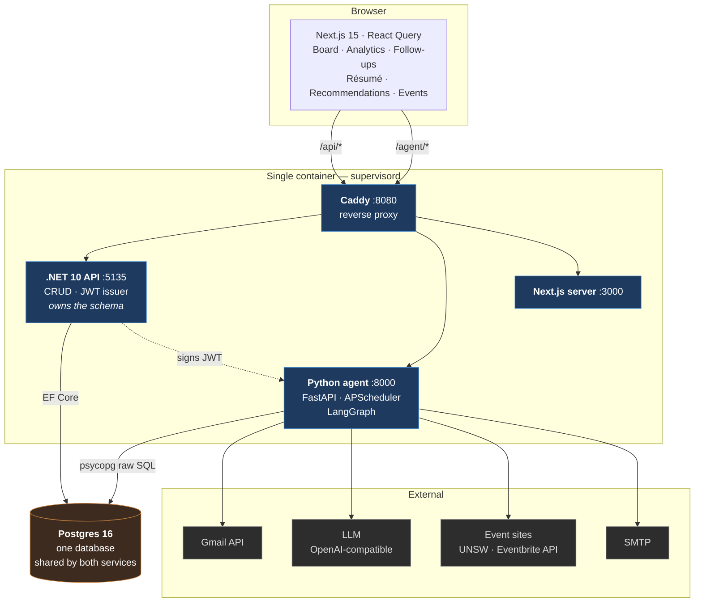
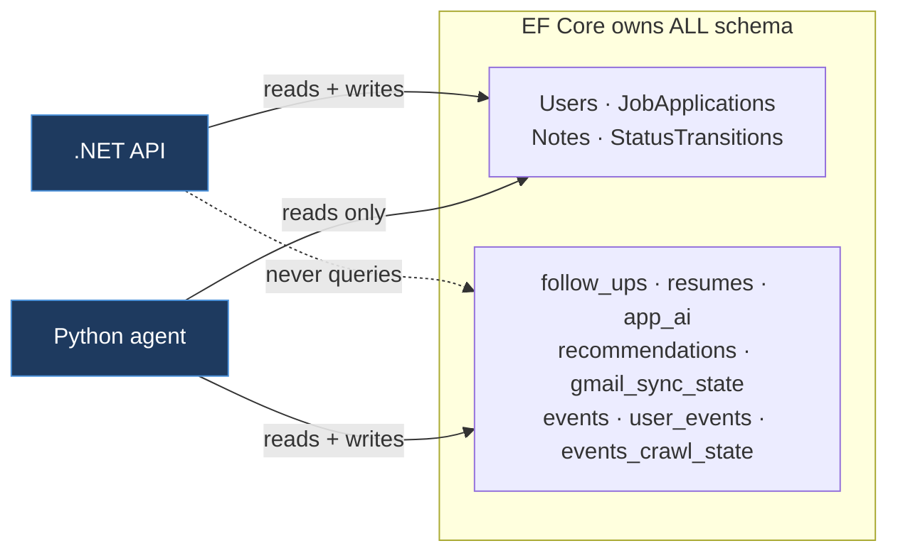
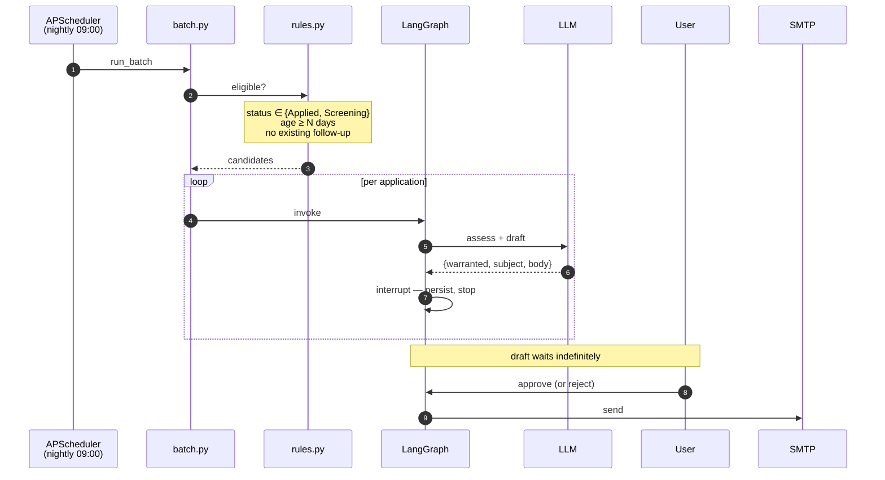
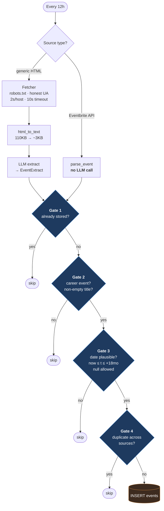
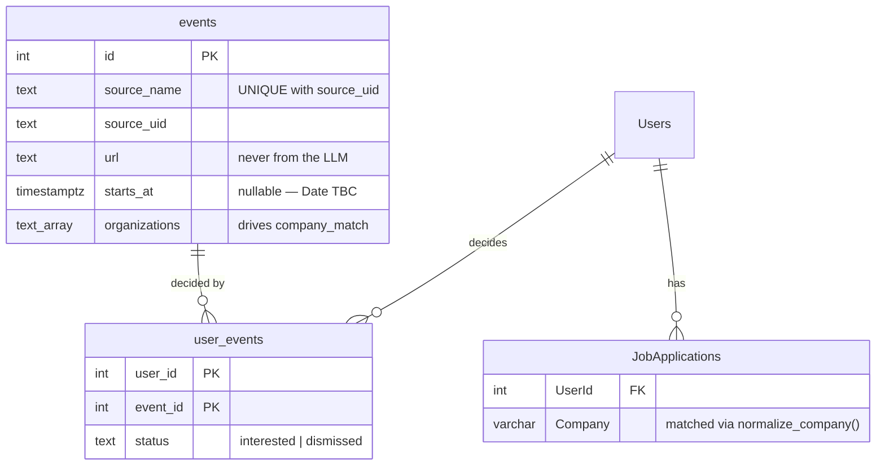

# Prospect — System Design

A job-application tracker with two autonomous agents bolted on: one drafts
follow-up emails for stale applications, one crawls the web for career events.
Everything ships as a single container.

---

## 1. The whole system



**Why one container.** Four processes under supervisord behind Caddy, deployed
as one unit. It trades independent scaling for a single deploy artifact — the
right call at this size, and the seam to split on later is Caddy's routing table.

**Trust boundary.** The .NET API signs JWTs; the agent verifies them with the
same shared key (HS256, `nameidentifier` claim → user id). The agent issues
nothing and has no user table of its own.

---

## 2. Who owns what

The single most important constraint in this system: **two services, two
languages, one database.**



**Schema ownership is not the same as data ownership.** EF Core declares every
table, including the eight the .NET code never touches. The agent reads and
writes those eight, plus reads `JobApplications` and `Users`.

This was not always true. The agent used to create its own tables at startup
with `CREATE TABLE IF NOT EXISTS`, which is create-only — Postgres skips the
statement when the table exists, *without comparing the definition*. Editing the
DDL therefore had no effect on any database that had run before, silently, and
only in environments that predate the change. The tables moved to EF because the
two declarations were never independent anyway: the events feed query joins
`JobApplications`, so the agent already depended on EF-managed schema.

| | |
|---|---|
| Schema authority | EF Core migrations, applied at backend startup |
| Migration ledger | `__EFMigrationsHistory` — one, not two |
| Agent's role | queries only; creates nothing |
| Startup order | supervisord `priority`: backend (10) before agent (20) |

---

## 3. Follow-up agent — human in the loop



**The interrupt is the design.** LangGraph halts mid-graph and checkpoints to
Postgres. Nothing is sent without a human clicking approve, and a draft can sit
for days without holding a process open.

**Race safety.** `POST /approve` reads the row `FOR UPDATE`, holding a row lock
for the transaction. A second concurrent approve blocks, then reads
`status='sent'` and returns 409 — no double send.

---

## 4. Event crawler — four gates



**Gate 1 runs before any network or LLM cost.** That is what makes re-reading the
same listing page every 12 hours nearly free.

**The hybrid is one field.** `Candidate.prefetched` carries a fully-formed event
when the source already has structured data. Eventbrite fills it and spends zero
LLM calls; generic HTML leaves it `None` and runs fetch → clean → extract. One
orchestration loop, two very different sources.

**No sync cursor.** Listing pages show what is current, so the crawler re-reads
them every run and Gate 1 absorbs the repeats. An event that failed at 09:00 is
retried at 21:00 — failure recovery is a property of the design, not code.

### Storage shape



`events` is **global** — one row per real-world event, no `user_id`. Events are
public, unlike Gmail-sourced recommendations, so a per-user table would mean
crawling and storing the same event once per user. Only the *opinion* is
per-user, and only once it exists: no `user_events` row means undecided.
Multi-user needs no migration.

`company_match` is **derived per request**, never stored:

```sql
EXISTS (SELECT 1 FROM "JobApplications" ja
         WHERE ja."UserId" = %(uid)s
           AND normalize_company(ja."Company") IN (
                 SELECT normalize_company(o) FROM unnest(e.organizations) AS o))
```

An event crawled last week lights up the moment you add an application to that
company. Nothing to backfill, and it cannot go stale. `normalize_company` strips
legal suffixes so a page saying "Monzo Bank Ltd" matches an application tracked
as "Monzo Bank".

---

## 5. Design decisions worth defending

| Decision | Why |
|---|---|
| **`url` never comes from the LLM** | `EventExtract` has no `url` field. A crawled page is text a stranger wrote; a page instructing the model to emit a phishing link has nowhere to put it. The stored URL is always the one the crawler fetched. |
| **Local times converted via `zoneinfo`** | Pages print local times with no offset; `starts_at` is `TIMESTAMPTZ`. Storing naive Sydney time shows a 6:30pm event at 4:30am the next day — and passes tests while doing it. |
| **Politeness is mandatory** | robots.txt, honest UA with a contact URL, one request per host ~2s apart, 25-page cap that logs when it truncates. Three sites twice a day is ~40 requests; these rules cost nothing and are the difference between welcome and IP-blocked. |
| **Failure isolation at two levels** | One dead site must not stop other sources; one bad page must not stop other events in that source. Errors are recorded to `events_crawl_state`, not swallowed. |
| **Filtering at read time, not crawl time** | The "My companies" filter runs in the browser over already-stored events, so a filter can never silently lose an event and changing your mind costs no re-crawl. |
| **One uvicorn worker** | APScheduler runs in-process and the LangGraph checkpointer lives in memory. Multiple workers means duplicate nightly runs and duplicate crawls. To scale out, move triggers to external cron and run the API stateless. |

---

## 6. Known limits

- **Single container, single worker.** Vertical scaling only. The split points
  are Caddy's routing table and the in-process scheduler.
- **`_SerializedGraph` global lock.** All `graph.invoke` calls serialize behind
  one process-wide lock because the `PostgresSaver` connection is not
  thread-safe. Upgrade path: a connection pool, if invoke contention ever
  limits throughput.
- **LLM extraction quality is unmeasured.** Gate 2's rejection rate on real
  listings has not been evaluated against live pages; `crawl_now.py` exists to
  judge it by eye.
- **No JS rendering.** `fetch.py` is plain HTTP. It is deliberately the single
  swap point for Playwright if a source ever needs a real browser.
