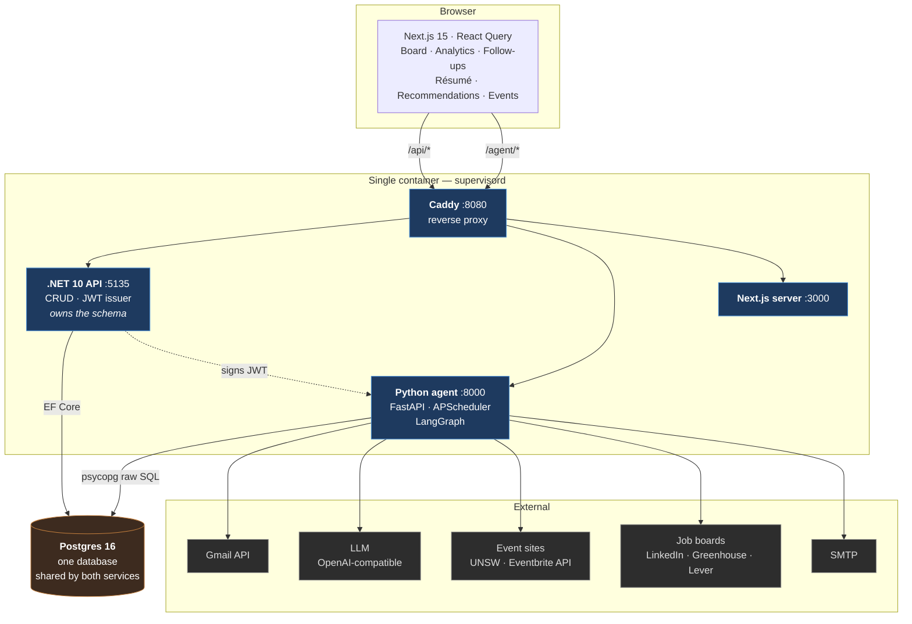
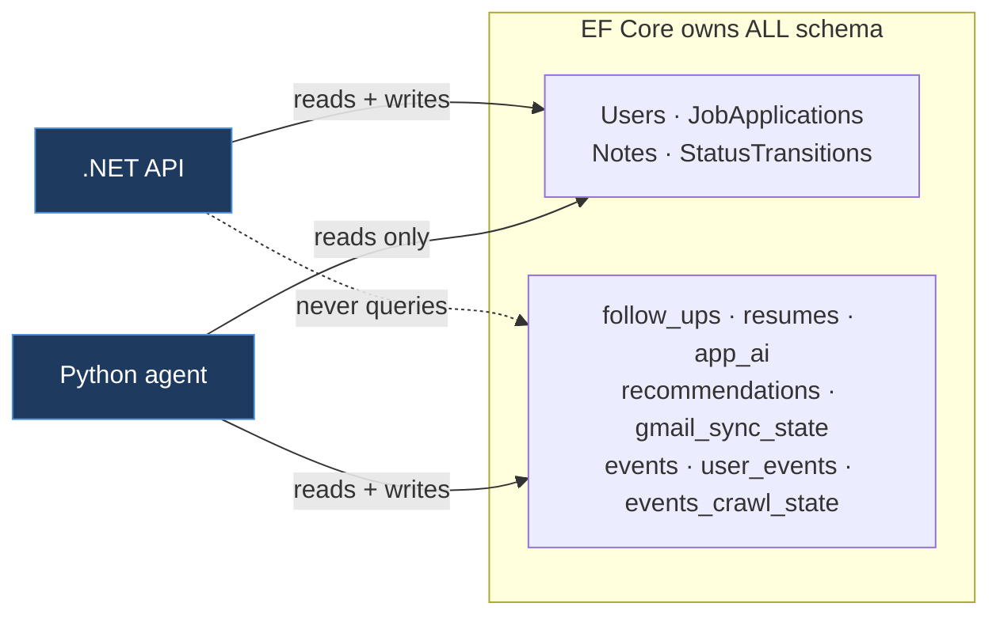
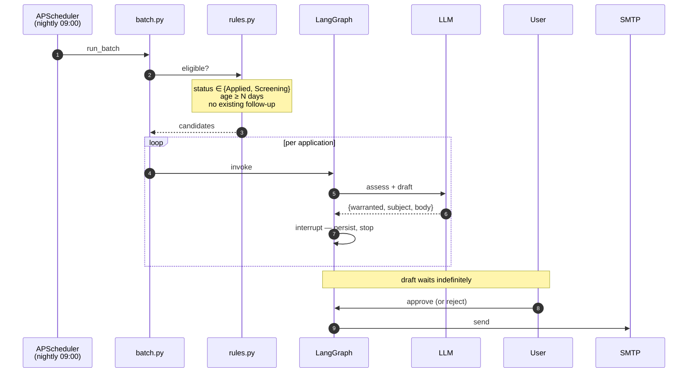
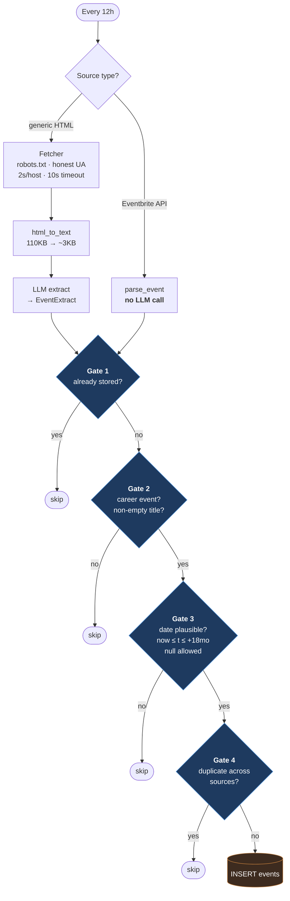
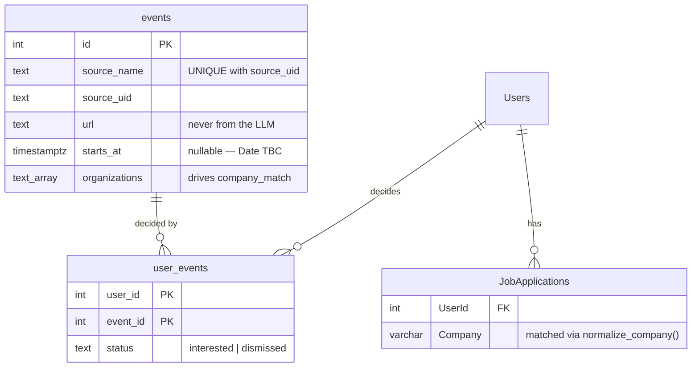
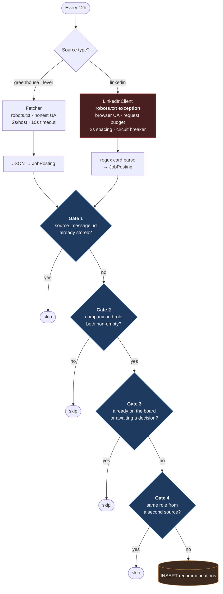

# Prospect — System Design

A job-application tracker with four background agents bolted on: one drafts
follow-up emails for stale applications, one turns Gmail job alerts into
recommendations, one crawls the web for career events, and one crawls job boards
for openings. Everything ships as a single container.

This document assumes you already know the shape of the system. If you don't,
read [`AGENTS-ONBOARDING.md`](AGENTS-ONBOARDING.md) first — it teaches the agent
service from scratch.

---

## 1. The whole system


```mermaid
graph TB
    subgraph client["Browser"]
        UI["Next.js 15 · React Query<br/>Board · Analytics · Follow-ups<br/>Résumé · Recommendations · Events"]
    end

    subgraph container["Single container — supervisord"]
        Caddy["<b>Caddy</b> :8080<br/>reverse proxy"]
        Backend["<b>.NET 10 API</b> :5135<br/>CRUD · JWT issuer<br/><i>owns the schema</i>"]
        Agent["<b>Python agent</b> :8000<br/>FastAPI · APScheduler<br/>LangGraph"]
        Web["<b>Next.js server</b> :3000"]
    end

    PG[("<b>Postgres 16</b><br/>one database<br/>shared by both services")]

    subgraph external["External"]
        Gmail["Gmail API"]
        LLM["LLM<br/>OpenAI-compatible"]
        Sites["Event sites<br/>UNSW · Eventbrite API"]
        Boards["Job boards<br/>LinkedIn · Greenhouse · Lever"]
        SMTP["SMTP"]
    end

    UI -->|"/api/*"| Caddy
    UI -->|"/agent/*"| Caddy
    Caddy --> Backend
    Caddy --> Agent
    Caddy --> Web

    Backend -->|EF Core| PG
    Agent -->|psycopg raw SQL| PG

    Agent --> Gmail
    Agent --> LLM
    Agent --> Sites
    Agent --> Boards
    Agent --> SMTP

    Backend -.->|"signs JWT"| Agent

    classDef svc fill:#1e3a5f,stroke:#4a90d9,color:#fff
    classDef db fill:#3d2b1f,stroke:#c47f3d,color:#fff
    classDef ext fill:#2d2d2d,stroke:#888,color:#ddd
    class Caddy,Backend,Agent,Web svc
    class PG db
    class Gmail,LLM,Sites,Boards,SMTP ext
```

**Why one container.** Four processes under supervisord behind Caddy, deployed
as one unit. It trades independent scaling for a single deploy artifact — the
right call at this size, and the seam to split on later is Caddy's routing table.

**Trust boundary.** The .NET API signs JWTs; the agent verifies them with the
same shared key (HS256, `nameidentifier` claim → user id). The agent issues
nothing and has no user table of its own.

---

## 2. Who owns what

The single most important constraint in this system: **two services, two
languages, one database.**


```mermaid
graph LR
    subgraph efowned["EF Core owns ALL schema"]
        direction TB
        T1["Users · JobApplications<br/>Notes · StatusTransitions"]
        T2["follow_ups · resumes · app_ai<br/>recommendations · gmail_sync_state<br/>events · user_events · events_crawl_state"]
    end

    NET[".NET API"] -->|"reads + writes"| T1
    NET -.->|"never queries"| T2
    PY["Python agent"] -->|"reads + writes"| T2
    PY -->|"reads only"| T1

    classDef own fill:#1e3a5f,stroke:#4a90d9,color:#fff
    class NET,PY own
```

**Schema ownership is not the same as data ownership.** EF Core declares every
table, including the eight the .NET code never touches. The agent reads and
writes those eight, plus reads `JobApplications` and `Users`.

This was not always true. The agent used to create its own tables at startup
with `CREATE TABLE IF NOT EXISTS`, which is create-only — Postgres skips the
statement when the table exists, *without comparing the definition*. Editing the
DDL therefore had no effect on any database that had run before, silently, and
only in environments that predate the change. The tables moved to EF because the
two declarations were never independent anyway: the events feed query joins
`JobApplications`, so the agent already depended on EF-managed schema.

| | |
|---|---|
| Schema authority | EF Core migrations, applied at backend startup |
| Migration ledger | `__EFMigrationsHistory` — one, not two |
| Agent's role | queries only; creates nothing |
| Startup order | supervisord `priority`: backend (10) before agent (20) |

---

## 3. Follow-up agent — human in the loop


```mermaid
sequenceDiagram
    autonumber
    participant S as APScheduler<br/>(nightly 09:00)
    participant B as batch.py
    participant R as rules.py
    participant G as LangGraph
    participant L as LLM
    participant U as User
    participant M as SMTP

    S->>B: run_batch
    B->>R: eligible?
    Note over R: status ∈ {Applied, Screening}<br/>age ≥ N days<br/>no existing follow-up
    R-->>B: candidates
    loop per application
        B->>G: invoke
        G->>L: assess + draft
        L-->>G: {warranted, subject, body}
        G->>G: interrupt — persist, stop
    end
    Note over G,U: draft waits indefinitely
    U->>G: approve (or reject)
    G->>M: send
```

**The interrupt is the design.** LangGraph halts mid-graph and checkpoints to
Postgres. Nothing is sent without a human clicking approve, and a draft can sit
for days without holding a process open.

**Race safety.** `POST /approve` reads the row `FOR UPDATE`, holding a row lock
for the transaction. A second concurrent approve blocks, then reads
`status='sent'` and returns 409 — no double send.

---

## 4. Event crawler — four gates


```mermaid
flowchart TD
    Start(["Every 12h"]) --> Src{"Source type?"}

    Src -->|"generic HTML"| Fetch["Fetcher<br/>robots.txt · honest UA<br/>2s/host · 10s timeout"]
    Fetch --> Clean["html_to_text<br/>110KB → ~3KB"]
    Clean --> Extract["LLM extract<br/>→ EventExtract"]

    Src -->|"Eventbrite API"| Pre["parse_event<br/><b>no LLM call</b>"]

    Extract --> G1
    Pre --> G1

    G1{"<b>Gate 1</b><br/>already stored?"} -->|yes| Skip1(["skip"])
    G1 -->|no| G2{"<b>Gate 2</b><br/>career event?<br/>non-empty title?"}
    G2 -->|no| Skip2(["skip"])
    G2 -->|yes| G3{"<b>Gate 3</b><br/>date plausible?<br/>now ≤ t ≤ +18mo<br/>null allowed"}
    G3 -->|no| Skip3(["skip"])
    G3 -->|yes| G4{"<b>Gate 4</b><br/>duplicate across<br/>sources?"}
    G4 -->|yes| Skip4(["skip"])
    G4 -->|no| Store[("INSERT events")]

    style G1 fill:#1e3a5f,stroke:#4a90d9,color:#fff
    style G2 fill:#1e3a5f,stroke:#4a90d9,color:#fff
    style G3 fill:#1e3a5f,stroke:#4a90d9,color:#fff
    style G4 fill:#1e3a5f,stroke:#4a90d9,color:#fff
    style Store fill:#3d2b1f,stroke:#c47f3d,color:#fff
```

**Gate 1 runs before any network or LLM cost.** That is what makes re-reading the
same listing page every 12 hours nearly free.

**The hybrid is one field.** `Candidate.prefetched` carries a fully-formed event
when the source already has structured data. Eventbrite fills it and spends zero
LLM calls; generic HTML leaves it `None` and runs fetch → clean → extract. One
orchestration loop, two very different sources.

**No sync cursor.** Listing pages show what is current, so the crawler re-reads
them every run and Gate 1 absorbs the repeats. An event that failed at 09:00 is
retried at 21:00 — failure recovery is a property of the design, not code.

### Storage shape


```mermaid
erDiagram
    events ||--o{ user_events : "decided by"
    Users ||--o{ JobApplications : has
    Users ||--o{ user_events : decides

    events {
        int id PK
        text source_name "UNIQUE with source_uid"
        text source_uid
        text url "never from the LLM"
        timestamptz starts_at "nullable — Date TBC"
        text_array organizations "drives company_match"
    }
    user_events {
        int user_id PK
        int event_id PK
        text status "interested | dismissed"
    }
    JobApplications {
        int UserId FK
        varchar Company "matched via normalize_company()"
    }
```

`events` is **global** — one row per real-world event, no `user_id`. Events are
public, unlike Gmail-sourced recommendations, so a per-user table would mean
crawling and storing the same event once per user. Only the *opinion* is
per-user, and only once it exists: no `user_events` row means undecided.
Multi-user needs no migration.

`company_match` is **derived per request**, never stored:

```sql
EXISTS (SELECT 1 FROM "JobApplications" ja
         WHERE ja."UserId" = %(uid)s
           AND normalize_company(ja."Company") IN (
                 SELECT normalize_company(o) FROM unnest(e.organizations) AS o))
```

An event crawled last week lights up the moment you add an application to that
company. Nothing to backfill, and it cannot go stale. `normalize_company` strips
legal suffixes so a page saying "Monzo Bank Ltd" matches an application tracked
as "Monzo Bank".

---

## 5. Job crawler — the same four gates, no LLM


```mermaid
flowchart TD
    Start(["Every 12h"]) --> Src{"Source type?"}

    Src -->|"greenhouse · lever"| API["Fetcher<br/>robots.txt · honest UA<br/>2s/host · 10s timeout"]
    Src -->|"linkedin"| LI["LinkedInClient<br/><b>robots.txt exception</b><br/>browser UA · request budget<br/>2s spacing · circuit breaker"]

    API --> Parse["JSON → JobPosting"]
    LI --> Regex["regex card parse<br/>→ JobPosting"]

    Parse --> G1
    Regex --> G1

    G1{"<b>Gate 1</b><br/>source_message_id<br/>already stored?"} -->|yes| Skip1(["skip"])
    G1 -->|no| G2{"<b>Gate 2</b><br/>company and role<br/>both non-empty?"}
    G2 -->|no| Skip2(["skip"])
    G2 -->|yes| G3{"<b>Gate 3</b><br/>already on the board<br/>or awaiting a decision?"}
    G3 -->|yes| Skip3(["skip"])
    G3 -->|no| G4{"<b>Gate 4</b><br/>same role from<br/>a second source?"}
    G4 -->|yes| Skip4(["skip"])
    G4 -->|no| Store[("INSERT recommendations")]

    style G1 fill:#1e3a5f,stroke:#4a90d9,color:#fff
    style G2 fill:#1e3a5f,stroke:#4a90d9,color:#fff
    style G3 fill:#1e3a5f,stroke:#4a90d9,color:#fff
    style G4 fill:#1e3a5f,stroke:#4a90d9,color:#fff
    style LI fill:#4a1f1f,stroke:#c44,color:#fff
    style Store fill:#3d2b1f,stroke:#c47f3d,color:#fff
```

**It added no tables.** A posting is a `recommendations` row — the same table the
Gmail poller writes and the same accept/dismiss cards the UI already rendered.
The key is a namespaced `source_message_id` (`linkedin:4426311357`), a column that
already carried the UNIQUE constraint an idempotent write needs. The whole feature
is `git diff main..HEAD -- prospect-backend/` returning empty.

That reuse is the reason the design is worth a section rather than a paragraph: a
job posting and an emailed job alert are the same thing arriving by a different
road, so giving them a second table would have meant a second UI, a second dedup
rule and a second accept path.

**`source_sender` holds a display name, not a config identifier.** The frontend
copies that field into the created `JobApplication.source`, permanently. Storing
`linkedin-frontend-syd` there would mean renaming a search in the YAML orphans
every application it ever produced, so sources expose `display_name`
(`Greenhouse · Databricks`) alongside the `name` used for configuration.

**No LLM anywhere on this path.** All three sources return structured data
already, so `JobPosting` is a plain dataclass rather than a pydantic model —
there is no hallucination to validate against and no prompt to inject into. The
`url`-never-from-the-LLM rule that §4 has to enforce by omitting a field is here
just a property of the pipeline.

**The gate ordering is the cost model,** exactly as in §4. Gate 1 runs before any
per-posting work, so re-reading the same search every 12 hours is nearly free,
and there is no sync cursor for the same reason the event crawler has none.

**Failure isolation is two-deep.** A source whose board 404s is one log line, not
a dead run; a malformed posting is one log line, not a dead source. The
per-posting `try` deliberately stops short of the INSERT — a raising write must
reach the caller rather than be caught mid-transaction, which would leave every
later write in the run silently degraded to zero.

LinkedIn's robots.txt exception, the compensating rate discipline, and how to
switch it off are in §6.

---

## 6. Design decisions worth defending

| Decision | Why |
|---|---|
| **`url` never comes from the LLM** | `EventExtract` has no `url` field. A crawled page is text a stranger wrote; a page instructing the model to emit a phishing link has nowhere to put it. The stored URL is always the one the crawler fetched. |
| **Local times converted via `zoneinfo`** | Pages print local times with no offset; `starts_at` is `TIMESTAMPTZ`. Storing naive Sydney time shows a 6:30pm event at 4:30am the next day — and passes tests while doing it. |
| **Politeness is mandatory** | robots.txt, honest UA with a contact URL, one request per host ~2s apart, 25-page cap that logs when it truncates. Three sites twice a day is ~40 requests; these rules cost nothing and are the difference between welcome and IP-blocked. |
| **One documented exception to the robots rule** | LinkedIn's `robots.txt` is `Disallow: /` for every user-agent, so the job crawler's LinkedIn source cannot go through `Fetcher`. It is the only code in the repo that fetches a path robots.txt actually disallows, confined to `jobs/sources/linkedin.py` — one file to audit, one file to delete. (It is not the only code that skips the check: `events/sources/eventbrite.py` also builds a bare `httpx.Client` and never calls `Fetcher.allowed()`. That one is benign — it talks to the documented `eventbriteapi.com` REST API with a token, which robots.txt does not disallow — but it is worth knowing about before you go looking for the "only" one.) LinkedIn's guest endpoints expect browser XHR headers, so the honest-UA rule can't apply either; `LinkedInClient` sends a Chrome UA instead. What compensates: **a soft per-run request budget** (`JOBS_MAX_REQUESTS_PER_RUN`, default 10) — soft because it is checked once on entry to `get()` but incremented per network attempt, so a `get()` that starts under budget may still burn its full retry ladder; at the default, the worst case is 9 single-attempt calls plus a tenth that retries 7 times, i.e. ~16 attempts, not 10. Plus requests spaced 2s apart, and a circuit breaker that doubles its skip-length — 1 run, then 2, then 4, capped at 16 — every time LinkedIn refuses: an exhausted 429/5xx retry ladder (which includes LinkedIn's 999 bot-block code) *and* a non-retryable 4xx such as 403. A transport error is not a refusal and does not open it. This is ToS-violating personal use; disable it (`enabled: false` in `job_sources.yaml`) in any shared deployment. Greenhouse and Lever carry no such exception — both go through `Fetcher` unchanged. |
| **Failure isolation at two levels** | One dead site must not stop other sources; one bad page must not stop other events in that source. Errors are recorded to `events_crawl_state`, not swallowed. |
| **Filtering at read time, not crawl time** | The "My companies" filter runs in the browser over already-stored events, so a filter can never silently lose an event and changing your mind costs no re-crawl. |
| **One uvicorn worker** | APScheduler runs in-process and the LangGraph checkpointer lives in memory. Multiple workers means duplicate nightly runs and duplicate crawls. To scale out, move triggers to external cron and run the API stateless. |

---

## 7. Known limits

- **Single container, single worker.** Vertical scaling only. The split points
  are Caddy's routing table and the in-process scheduler.
- **`_SerializedGraph` global lock.** All `graph.invoke` calls serialize behind
  one process-wide lock because the `PostgresSaver` connection is not
  thread-safe. Upgrade path: a connection pool, if invoke contention ever
  limits throughput.
- **LLM extraction quality is unmeasured.** Gate 2's rejection rate on real
  listings has not been evaluated against live pages; `crawl_now.py` exists to
  judge it by eye.
- **No JS rendering.** `fetch.py` is plain HTTP. It is deliberately the single
  swap point for Playwright if a source ever needs a real browser.
- **Job crawler is single-user.** Searches are deployment-wide YAML feeding one
  `RECO_USER_ID`. The migration path — a global `job_postings` table with per-user
  opinions in `user_job_postings`, mirroring `events`/`user_events` — is written up in
  `docs/superpowers/specs/2026-08-07-job-crawler-design.md`.
- **LinkedIn markup rot.** The LinkedIn source parses HTML with regex. A successful
  response with a real body yielding zero cards is logged as a parse failure rather
  than as zero results, so breakage is visible; it is not prevented. Greenhouse and
  Lever have no equivalent failure mode.
